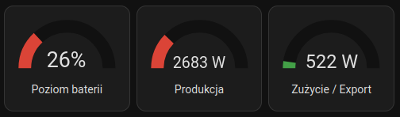
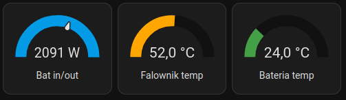
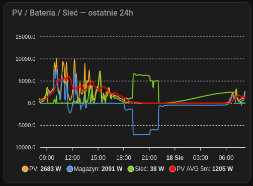

# Przykłady konfiguracji kart (Examples)

Poniżej znajdują się przykładowe konfiguracje kart Lovelace wykorzystywane w projekcie wraz z podglądem wizualnym.

---

### 1. Statystyki główne
* **Plik konfiguracji:** `card1.yaml`
* **Opis:** Najważniejsze statystyki i kluczowe wskaźniki.

---

### 2. Panel obserwacji i alertów
* **Plik konfiguracji:** `card2.yaml`
* **Opis:** Przeznaczony do bieżącej obserwacji oraz wyświetlania alertów.

---

### 3. Wykres przepływów
* **Plik konfiguracji:** `chart.yaml`
* **Opis:** Główny wykres przedstawiający przepływy.

